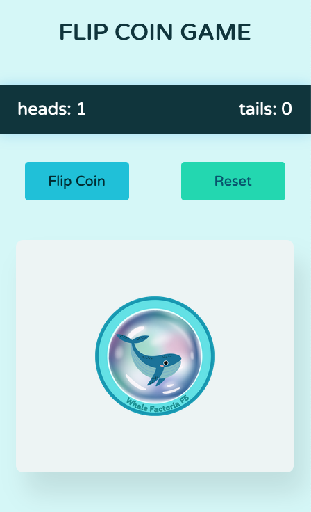

# Flip Coin Game in JavaScript

## 🐋  Try it 

flipcoinwhale.netlify.app

Welcome to the FlipCoin game implemented in JavaScript. This is a fun and simple coin-flipping game where you can see if the coin lands on heads or tails, and it keeps track of the number of times each side appears.

## 🐋  How to Play

1. Open the `index.html` file in your preferred web browser.
2. Click the "Flip Coin" button to initiate a coin flip.
3. The result (heads or tails) will be displayed on the screen.
4. The counters for heads and tails will be updated accordingly.

## 🌊 Project Structure

- `index.html`: Contains the basic HTML structure and links to the JavaScript file.
- `style.css`: Style sheet file for styling the appearance of the game.
- `script.js`: Houses the game logic and counter management.

## 🐚 Technologies Used

  

